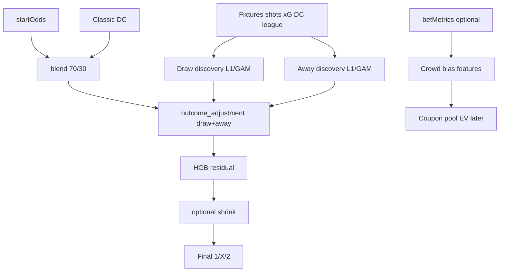

# Roadmap update: Away ("2") drivers + public "1" bias

**Target file:** [`/home/tomas/.cursor/plans/log_loss_0.99_roadmap_947fd553.plan.md`](/home/tomas/.cursor/plans/log_loss_0.99_roadmap_947fd553.plan.md)  
**Sync copy:** [`docs/log_loss_0.99_roadmap_947fd553.plan.md`](docs/log_loss_0.99_roadmap_947fd553.plan.md)

---

## What to add (summary)

Extend **Phase 3** from draw-only to **outcome-specific discovery** for **X and 2**, plus a **crowd vs odds** analysis layer. **HGB remains the residual engine.** **DC + fixture data** remain the structural core (`p_away_dc`, `λ_away`, xG features).

---

## Frontmatter todos (add after `phase3-draw-ship`)

```yaml
  - id: phase3-away-discover
    content: "Phase 3.3: Away-win driver discovery (L1/GAM, label==2); rank features vs p_away_blend/DC"
    status: pending
  - id: phase3-away-ship
    content: "Phase 3.4: Ship away logit adjustment; unify with draw in outcome_adjustment module"
    status: pending
  - id: phase3-crowd-bias
    content: "Phase 3.5: Public play bias analysis (betMetrics vs startOdds); optional crowd features for pool/coupon"
    status: pending
  - id: phase3-blend-cal
    content: "Phase 3.6: Conditional blend weights; per-outcome LL (1/X/2) on validation"
    status: pending
```

(Renumber existing `phase3-blend-cal` from 3.3 → 3.6.)

---

## Rename / broaden Phase 3 header

**From:** "Draw driver discovery ML + prediction adjustments"  
**To:** "Outcome driver discovery (X and 2) + prediction adjustments"

Add **project anchor** paragraph:

> End goal: improved **DC + data → blend → explicit outcome adjustments → HGB residual** prediction engine. Discovery ML explains *what drives each outcome*; shipping adjusts baseline probs; HGB handles remaining error.

---

## Update target architecture diagram



**Pipeline order:** conditional blend → **draw adjust** → **away adjust** (renormalize after each or once at end) → HGB.

---

## New section: 3.7 Away-win ("2") driver discovery

Mirror Section 3.1–3.2 for **away wins**.

### Analysis dataset (from `dataset.csv` + optional DB join)

| Column | Purpose |
|--------|---------|
| `is_away = (label == "2")` | Binary target |
| `away_surprise = is_away - p_away_blend` | Baseline error |
| `p_away_market_norm`, `p_away_blend`, `p_away_dc_norm` | Controls |
| **DC / xG drivers** | `expected_away_goals`, `expected_goal_difference`, `market_vs_dc_away`, `away_opponent_adjusted_attack`, `home_opponent_adjusted_defence`, `away_npxg_for`, `home_npxg_against` |
| **Context** | `rest_day_difference`, `league_away_win_rate`, `league_home_win_rate`, `league_upset_rate`, `favourite_strength`, signed favourite `(p_away - p_home)` |
| **Home-favourite upset proxy** | `home_is_favourite = (p_home_market > p_away_market)` — many "2" results are away upsets when home favoured |

**Incremental framing:** include `p_away_blend` in L1/GAM so discovery finds signal **beyond odds+DC**, not "away team exists."

### Discovery models

Reuse [`calc/draw_driver_analysis.py`](calc/draw_driver_analysis.py) → generalize to **`calc/outcome_driver_analysis.py`** with `outcome: Literal["X", "2"]` (or parallel `analyze_away_drivers.py` calling shared core).

| Model | Target |
|-------|--------|
| L1 logistic | `is_away` |
| GAM | nonlinear on top L1 features (e.g. `expected_goal_difference`) |
| Away-error regression | `is_away - p_away_blend` |

**Artifacts:** `artifacts/away_analysis/l1_coefficients.json`, `docs/away_driver_analysis.md`

**DC link:** document when `market_vs_dc_away > 0` correlates with away wins — validates tuning DC (Phase 1) helps "2" not only home/draw.

### Ship away adjustment

Extend [`calc/draw_adjustment.py`](calc/draw_adjustment.py) → **`calc/outcome_adjustment.py`**:

```python
# logit(p_away') = logit(p_away_blend) + β0 + Σ βi * feature_i
# apply after draw adjust; renormalize 1/X/2
```

Config: **`config/away_adjustment.json`** (3–8 terms, same discipline as draw).

**Candidate β features (from discovery):** `market_vs_dc_away`, `expected_goal_difference`, `away_opponent_adjusted_attack`, `rest_day_difference`, `league_away_win_rate`, `away_favourite_indicator`.

---

## New section: 3.8 Public "1" bias (odds vs crowd)

**Two signals (do not conflate):**

| Signal | Source | In ML today? |
|--------|--------|--------------|
| **startOdds** | [`STMatchOddsRepository`](objects/repositories/st_match_odds_repository.py) `startOdds` | Yes → `p_*_market` |
| **Public play** | [`STMatchBetRepository`](objects/repositories/st_match_bet_repository.py) `distribution_1/X/2` | **No** — stored but unused in features |

### Analysis (mathematical exploration)

New script: **`scripts/analyze_crowd_bias.py`**

Per historical match:

```text
crowd_share_1 = distribution_1 / (distribution_1 + distribution_X + distribution_2)
odds_share_1    = p_home_market_norm   # de-vigged from startOdds
crowd_bias_1    = crowd_share_1 - odds_share_1   # positive = public overweights home vs line
```

**Questions to answer OOS:**

1. When `crowd_bias_1 > threshold`, is result "2" more frequent than `p_away_blend` implies? (home-favourite public overweight → away upset value)
2. Calibration: does `p_home_market` overstate "1" in ST coupons vs actual rate?
3. Slice: `home_is_favourite` + high `crowd_bias_1` → away win rate vs model

**Deliverable:** [`docs/crowd_bias_analysis.md`](docs/crowd_bias_analysis.md)

### Use in prediction engine vs coupon layer

| Use | Recommendation |
|-----|----------------|
| **Baseline prob adjustment (LL)** | Only if crowd bias **predicts results beyond startOdds** OOS — usually weak; odds already encode much of this |
| **Optional features for discovery** | `crowd_bias_1`, `crowd_bias_2` joined at dataset build for L1/GAM — test incrementally |
| **Coupon / pool EV (later Phase 4+)** | When model says "2" and `crowd_bias_1` high → fewer sharers if right; informs stake sizing, not core LL |

**Dataset change:** join `stryktipset_match_bets` in [`calc/residual_ml_dataset.py`](calc/residual_ml_dataset.py) → columns `crowd_share_1`, `crowd_share_2`, `crowd_bias_1` (analysis + optional features).

---

## Update Section 3.4 Evaluation

Add per-outcome metrics:

| Metric | Outcomes |
|--------|----------|
| Log loss | pooled + **draw-only + away-only + home-only** |
| Brier | per outcome |
| Ablation rows | extend A–D with **away-adjust-only** and **draw+away adjust** |

**Phase 3 exit criteria (add):**

- [ ] Away log loss improves OOS vs blend (same bar as draw)
- [ ] `docs/away_driver_analysis.md` + `docs/crowd_bias_analysis.md` complete
- [ ] `config/away_adjustment.json` shipped; HGB retrained on draw+away-adjusted blend

---

## Update risk register

| Risk | Mitigation |
|------|------------|
| Away adjust hurts home LL | Renormalize; cap away logit delta; report per-outcome LL |
| Crowd data confounded with odds | Treat crowd as **coupon layer** first; only add to prob engine if incremental OOS |
| Draw + away double-adjust overfits | Max 3–8 terms each; joint validation; simpler unified `outcome_adjustment.json` optional |

---

## Update files table

| Action | Path |
|--------|------|
| **Rename/generalize** | `calc/draw_driver_analysis.py` → `calc/outcome_driver_analysis.py` |
| **Rename/generalize** | `calc/draw_adjustment.py` → `calc/outcome_adjustment.py` |
| **Create** | `config/away_adjustment.json` |
| **Create** | `docs/away_driver_analysis.md` |
| **Create** | `docs/crowd_bias_analysis.md` |
| **Create** | `scripts/analyze_crowd_bias.py` |
| **Extend** | `scripts/analyze_draw_drivers.py` → `scripts/analyze_outcome_drivers.py` (`--outcome X|2`) |
| **Modify** | `calc/residual_ml_dataset.py` (join `match_bet` distributions) |
| **Modify** | `calc/residual_ml_feature_assembler.py` (optional crowd features) |

---

## Realistic milestone note (update table)

After Phase 3: gains from **draw + away** explicit adjust may add **~0.003–0.008** pooled LL if DC/xG drivers are real; crowd bias analysis primarily supports **coupon strategy**, not LL, unless proven incremental.
