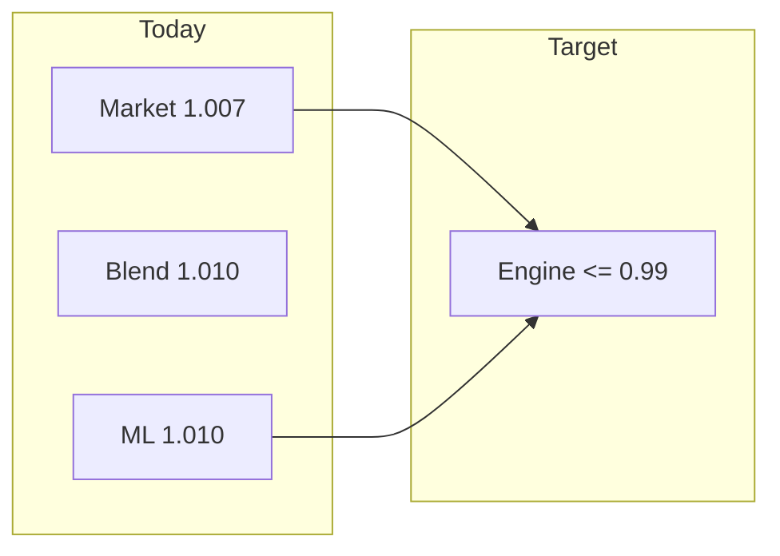
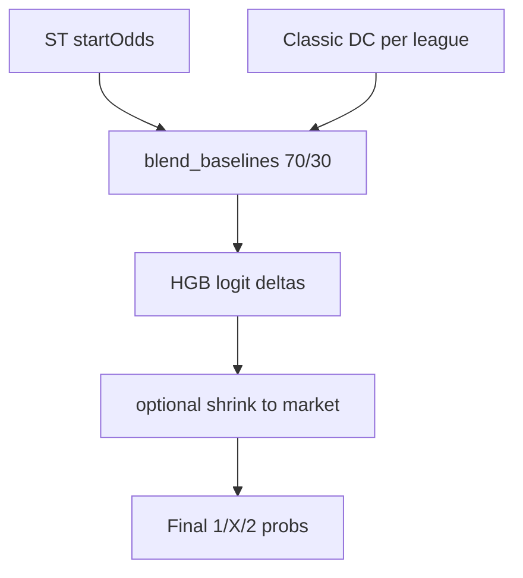
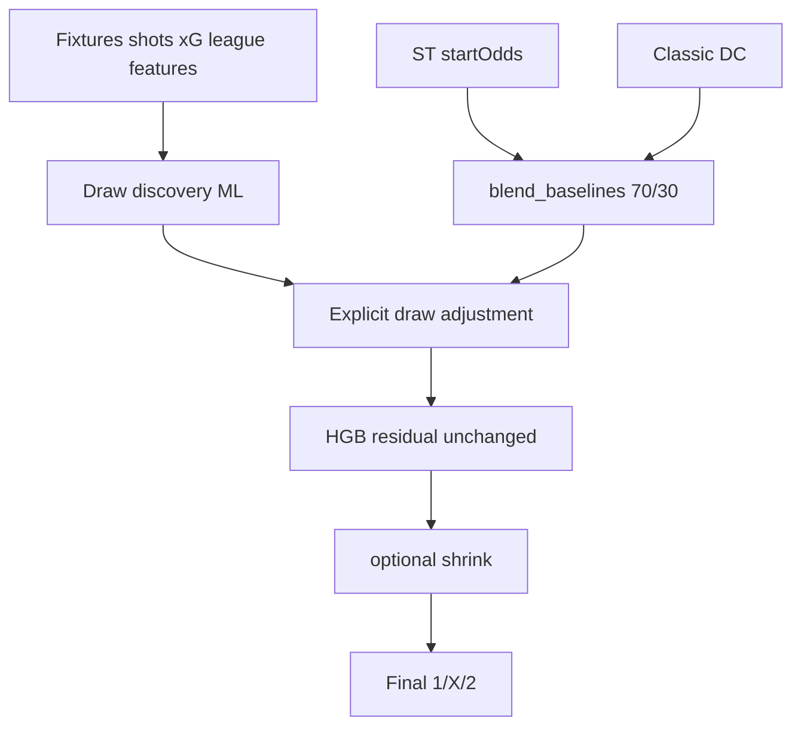
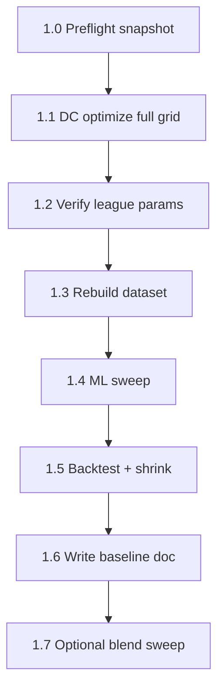
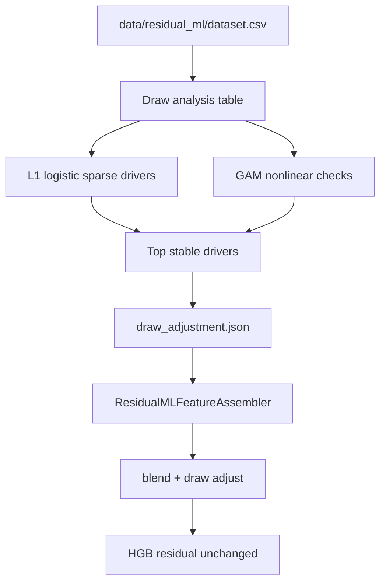
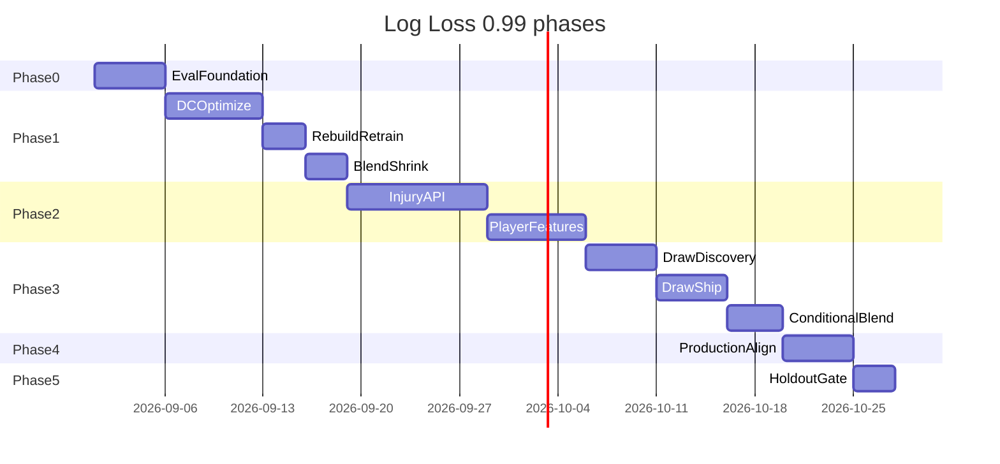

# Log Loss 0.99 Roadmap

**Deliverable:** save this plan as [`docs/log_loss_0.99_roadmap.md`](docs/log_loss_0.99_roadmap.md) after approval.

---

## Goal and success criteria

| Criterion | Definition |
|-----------|------------|
| **Primary metric** | Mean multiclass log loss ≤ **0.99** on held-out validation slice |
| **Scoring** | Same as [`scripts/backtest_residual_ml.py`](scripts/backtest_residual_ml.py): sklearn `log_loss` on labels `{1→0, X→1, 2→2}` |
| **Split** | Chronological time split (last 15–20% by `match_date`); **no** `--all-rows` for final claims |
| **Stability** | Within **±0.01** across at least 2 yearly (or seasonal) chunks |
| **Sanity** | Still beats market on identical rows |
| **Production** | Features and probs available at real coupon cutoff (not kickoff-only leakage) |

### Current baseline (documented in [`models/residual_ml/sweep_best/sweep_results.json`](models/residual_ml/sweep_best/sweep_results.json))

| System | Log loss (20% val, 518 rows) |
|--------|------------------------------|
| Market | **1.0068** |
| Blend 70/30 | **1.0057** (post DC tune) |
| ML + shrink α=0.5 | **1.0022** (post DC tune) |
| Target | **0.9900** |

**Gap to close:** ~**0.017** vs market, ~**0.020** vs current ML.

**Important:** validation fraction is **aligned** at **0.20** across sweep ([`scripts/train_residual_ml.py`](scripts/train_residual_ml.py)), pipeline ([`scripts/run_classic_dc_ml_pipeline.sh`](scripts/run_classic_dc_ml_pipeline.sh)), backtest, and DC optimizer. Canonical constants live in [`config/eval_protocol.py`](config/eval_protocol.py).



---

## Architecture today (anchor for changes)



**Target architecture (Phase 3 adds draw layer; HGB role unchanged):**



Key files:
- Blend: [`calc/residual_ml/baseline.py`](calc/residual_ml/baseline.py)
- Features: [`calc/residual_ml_feature_assembler.py`](calc/residual_ml_feature_assembler.py)
- Dataset: [`calc/residual_ml_dataset.py`](calc/residual_ml_dataset.py)
- Training: [`calc/residual_ml_trainer.py`](calc/residual_ml_trainer.py)
- Live: [`calc/probality_manager.py`](calc/probality_manager.py)
- DC params: [`config/classic_dc_league_params.json`](config/classic_dc_league_params.json)

---

## Phase 0 — Evaluation foundation (prerequisite)

**Objective:** Trustworthy measurement before chasing 0.99.

### 0.1 Standardize evaluation protocol

- Pick one canonical `VALIDATION_FRACTION` (recommend **0.20** to match current best sweep) across train, backtest, and DC optimizer.
- Document draw window (currently **4760–4960** in [`scripts/build_residual_ml_dataset.py`](scripts/build_residual_ml_dataset.py)).
- Add evaluation section to roadmap doc with exact commands.

### 0.2 Multi-slice reporting

Extend backtest reporting (or add `scripts/eval_residual_ml.py`) to output:

- Pooled log loss (primary)
- Per-year / per-draw-quarter slices
- Per-league slices (add `league_external_id` column to dataset CSV — currently missing)
- Top-pick accuracy alongside log loss
- Row counts and skip reasons

### 0.3 Holdout policy

Reserve a **final holdout** (e.g. last 5% of draws or one calendar quarter) that is **not** used for:
- DC grid search
- ML hyperparameter sweep
- Shrink α tuning
- Blend weight tuning

Use only once at the end to confirm 0.99.

### 0.4 Ablation matrix (required for every phase)

| Row | Configuration |
|-----|----------------|
| A | Market only |
| B | Blend (fixed 70/30) |
| C | Blend + ML (no shrink) |
| D | Blend + ML + best shrink α |
| E | Best system from prior phase + new feature |

**Exit criteria:** Reproducible numbers; ablation table in doc; holdout defined.

### Phase 0 — Completed (2026-09-02)

**Evaluation protocol** ([`config/eval_protocol.py`](config/eval_protocol.py)):

| Constant | Value | Purpose |
|----------|-------|---------|
| `VALIDATION_FRACTION` | **0.20** | Aligned with [`utils/time_split.py`](utils/time_split.py) |
| `TUNING_DRAW_MAX` | **4950** | Draws used for DC/ML tuning and default eval |
| `HOLDOUT_DRAW_MIN` | **4951** | Final holdout (draws 4951–4960; ~5% of window) |
| Draw window | **4760–4960** | [`config/stryktipset.py`](config/stryktipset.py) |

**Canonical commands:**

```bash
export PYTHONPATH=.

# Multi-slice eval (default: 20% val, holdout excluded → 492 rows on dataset.csv)
python scripts/eval_residual_ml.py \
  --dataset data/residual_ml/dataset.csv \
  --model models/residual_ml/sweep_best/model.pkl \
  --validation-fraction 0.20

# Backtest ablation (default: holdout excluded; same 492-row tuning slice as eval)
python scripts/backtest_residual_ml.py \
  --dataset data/residual_ml/dataset.csv \
  --model models/residual_ml/sweep_best/model.pkl \
  --validation-fraction 0.20

# Full validation time split including holdout draws (518 rows — sweep comparison)
python scripts/backtest_residual_ml.py \
  --dataset data/residual_ml/dataset.csv \
  --model models/residual_ml/sweep_best/model.pkl \
  --validation-fraction 0.20 \
  --include-holdout

# Phase 5 only — include holdout draws in eval too
python scripts/eval_residual_ml.py --include-holdout
```

**Holdout policy:** draws **4951–4960** are excluded from tuning, sweep, shrink α search, and default backtest/eval (`TUNING_DRAW_MAX=4950`). Use `--include-holdout` / `--no-exclude-holdout` for Phase 5 or historical sweep comparison.

**Canonical tuning slice:** 20% time split **with holdout excluded** (**492 rows** on current `dataset.csv`). `scripts/backtest_residual_ml.py` and `scripts/eval_residual_ml.py` both default to this.

**Ablation matrix (post-pipeline `dataset.csv`):**

| Row | Configuration | Log loss (492 rows, default) | Log loss (518 rows, `--include-holdout`) |
|-----|---------------|------------------------------|------------------------------------------|
| A | Market only | 1.0291 | **1.0068** |
| B | Blend (70/30) | 1.0231 | **1.0057** |
| C | Blend + ML (no shrink) | 0.9771 | **1.0091** |
| D | Blend + ML + best shrink | α=0.0 → 0.9771 | α=0.5 → **1.0022** |
| — | DC only (context) | 1.0377 | 1.0375 |

The **492-row** slice is canonical for tuning gates (holdout excluded). The **518-row** column matches the ML sweep row count and is used for historical sweep comparison.

---

## Phase 1 — Full DC pipeline → retrain → measure (detailed runbook)

**Based on:** this roadmap, current codebase ([`scripts/run_classic_dc_ml_pipeline.sh`](scripts/run_classic_dc_ml_pipeline.sh)), and pre-tune baselines in [`models/residual_ml/sweep_best/sweep_results.json`](models/residual_ml/sweep_best/sweep_results.json).

**Objective:** Establish a **post-DC-tuning baseline** — the reference point for all later phases (injuries, blend, 0.99). No new injury features in this phase.

**Expected lift:** ~0.003–0.008 pooled log loss vs pre-tune baseline.

**Deliverable:** [`docs/baseline_after_dc_tune.md`](docs/baseline_after_dc_tune.md) with before/after ablation table, artifact paths, and env snapshot.



---

### 1.0 Preflight — freeze “before” baseline

Do this **before** changing `classic_dc_league_params.json` or rebuilding the dataset.

#### 1.0.1 Align evaluation protocol

| Setting | Value | Why |
|---------|-------|-----|
| `VALIDATION_FRACTION` | **0.20** | Matches best sweep in `sweep_results.json` (518 val rows) |
| Draw window | **4760–4960** | [`scripts/build_residual_ml_dataset.py`](scripts/build_residual_ml_dataset.py) |
| DC engine | `classic` | Per-league tuned params apply |
| HA mode | `fast` | Pipeline default; ~20h dataset rebuild |

Pipeline default `VALIDATION_FRACTION` is **0.20** in [`scripts/run_classic_dc_ml_pipeline.sh`](scripts/run_classic_dc_ml_pipeline.sh) (aligned with sweep and backtest).

#### 1.0.2 Snapshot pre-tune artifacts

Copy to a dated folder (e.g. `artifacts/baseline_pre_dc_tune_YYYYMMDD/`):

| File | Purpose |
|------|---------|
| `dataset.csv` | From `data/residual_ml/dataset_classic.csv` — **pre-tune proxy** (classic DC before full grid) |
| `sweep_best/` | `model.pkl`, `sweep_results.json`, etc. (copied at snapshot time) |
| `backtest.txt` | Generated backtest on `dataset.csv` @ 20% validation |
| `classic_dc_league_params.pre_tune_note.txt` | Explains why league params are **not** copied |

Do **not** copy `config/classic_dc_league_params.json` into the snapshot if the pipeline has already run — it would be post-tune.

#### 1.0.3 Record pre-tune metrics (copy from existing backtest or re-run)

Re-run backtest on **current** model to confirm numbers (do not use `--all-rows`):

```bash
export PYTHONPATH=.
export VALIDATION_FRACTION=0.20
python scripts/backtest_residual_ml.py \
  --dataset data/residual_ml/dataset.csv \
  --model models/residual_ml/sweep_best/model.pkl \
  --validation-fraction 0.20
```

**Pre-tune reference (20% val, from `sweep_results.json`):**

| System | Log loss | Rows |
|--------|----------|------|
| Market | 1.0068 | 518 |
| Blend 70/30 | 1.0100 | 518 |
| ML (no shrink) | 1.0103 | 518 |

Also run standalone DC backtest for context:

```bash
python scripts/backtest_classic_dixon_coles.py  # pooled DC vs market on ST eval set
```

#### 1.0.4 Preflight checklist

- [x] DB up to date (fixtures through draw 4960)
- [x] `PYTHONPATH=.` set for all commands
- [x] Pre-tune artifacts copied (`artifacts/baseline_pre_dc_tune_20250902/`)
- [x] Pre-tune backtest output saved to `artifacts/baseline_pre_dc_tune_*/backtest.txt`
- [x] `VALIDATION_FRACTION=0.20` agreed for optimizer, train sweep, and backtest

#### Phase 1.0 Preflight — Completed (2026-09-02)

**Artifact path:** [`artifacts/baseline_pre_dc_tune_20250902/`](artifacts/baseline_pre_dc_tune_20250902/)

**Post-hoc proxy:** the full DC pipeline had already run when this snapshot was taken. Only `dataset.csv` (from `dataset_classic.csv`) reliably preserves pre-tune DC features. `classic_dc_league_params.json` is intentionally **omitted** (see `classic_dc_league_params.pre_tune_note.txt`).

Created by:

```bash
PYTHONPATH=. python scripts/snapshot_preflight_baseline.py --date 20250902
```

Snapshot contents: `dataset.csv` (pre-tune proxy), `sweep_best/` (copied at snapshot time), `backtest.txt`, README with metrics from copied `sweep_results.json` (market 1.0068, blend 1.0057, ML 1.0091 @ 518 val rows).

---

### 1.1 DC optimize — full per-league grid

#### 1.1.1 What runs

[`scripts/optimize_classic_dixon_coles.py`](scripts/optimize_classic_dixon_coles.py) with [`config/classic_dc_optimization_grid.json`](config/classic_dc_optimization_grid.json):

| Parameter | Values | Count |
|-----------|--------|-------|
| `xi` | 0.0001 … 0.005 | 7 |
| `lookback` (days) | 365, 730, 1095, 1460, 1825 | 5 |
| `rho` | -0.20 … 0.05 | 6 |
| **Combos per league** | | **210** |

Per combo: walk-forward on that league’s validation matches — **one scipy MLE fit per calendar day** in the validation window ([`calc/dixon_coles/optimizer.py`](calc/dixon_coles/optimizer.py)).

#### 1.1.2 Command (overnight job)

```bash
cd /home/tomas/wetail/git/st
export PYTHONPATH=.
export VALIDATION_FRACTION=0.20

# Optional: smoke test first (~minutes)
# GRID_CONFIG=config/classic_dc_optimization_grid_smoke.json

python -u scripts/optimize_classic_dixon_coles.py \
  --validation-fraction 0.20 \
  --draw-min 4760 \
  --draw-max 4950 \
  --grid-config config/classic_dc_optimization_grid.json \
  --output config/classic_dc_league_params.json \
  2>&1 | tee artifacts/dc_optimize_full_$(date +%Y%m%d).log
```

**Runtime estimate:** many hours on one CPU (210 × ~unique val days × ~eligible leagues). Run detached; do not chain dataset rebuild until this completes.

#### 1.1.3 Optimizer inputs (fixed unless experimenting)

From grid JSON:

- `min_eval_matches_per_league`: **15** (leagues with fewer val matches are skipped)
- `min_training_matches`: **50**
- `min_team_matches`: **5**
- Fixture preload: **1825 days** before latest validation date

#### 1.1.4 Coverage gaps to address (optional before or after first full run)

| Issue | Location | Action |
|-------|----------|--------|
| Only 4/17 val leagues tuned today | `classic_dc_league_params.json` | Full grid should populate more |
| 13 leagues skipped (&lt;15 val matches) | optimizer stdout | Consider `min_eval_matches_per_league: 10` in a second grid JSON |
| `Missing league for home_team` row drops | dataset build | Fix league mapping in [`calc/dixon_coles/service.py`](calc/dixon_coles/service.py) |
| DC fallback to strength engine | [`calc/residual_ml_feature_assembler.py`](calc/residual_ml_feature_assembler.py) | Log/count fallbacks during rebuild; thin leagues may not benefit from tune |

**Do not** use optimizer validation log loss as the Phase 1 success metric — it is DC-only on a subset. The gate is **full pipeline backtest** (Section 1.5).

#### Phase 1.1 DC optimize — Completed (2026-09-02)

Full grid run wrote **5 tuned leagues** to [`config/classic_dc_league_params.json`](config/classic_dc_league_params.json): **39, 41, 42, 45, 180**.

Coverage verified with:

```bash
PYTHONPATH=. python scripts/verify_dc_league_coverage.py
```

**Verify output (2026-09-02):**

```
Validation slice: 456 matches, 17 leagues (fraction=0.2, draws 4760–4960)
Params file: config/classic_dc_league_params.json (5 tuned leagues)

Eligible leagues (>= min_eval_matches):
  league=39 matches=134 status=tuned
  league=41 matches=67 status=tuned
  league=42 matches=22 status=tuned
  league=45 matches=19 status=tuned
  league=180 matches=154 status=tuned

Skipped leagues (12): 61, 71, 78, 88, 103, 113, 114, 140, 179, 244, 311, 591
  (each with < 15 validation matches)

Summary: eligible=5 tuned=5 missing=0 skipped=12
All eligible leagues have tuned params.
```

---

### 1.2 Verify optimizer output

After optimize completes, check:

```bash
# League count in output
python -c "import json; d=json.load(open('config/classic_dc_league_params.json')); print(len(d), 'leagues')"
```

**Acceptance criteria:**

- [x] File written and valid JSON
- [x] More leagues than smoke run (5 eligible leagues tuned)
- [x] Each entry has `xi`, `lookback`, `rho`, `log_loss`, `n_evaluated`
- [x] Optimizer log shows `Pooled weighted DC log loss` (informational only)
- [x] Copy output to `artifacts/baseline_post_dc_tune_*/classic_dc_league_params.json`

**Sanity:** compare per-league `log_loss` in params file vs global defaults — large swings expected for PL (39), cups, lower leagues.

**Env var for downstream:** `CLASSIC_DC_LEAGUE_PARAMS_PATH=config/classic_dc_league_params.json` (default in [`DataSourceConfig`](objects/schema/data_classes/data_sources.py)).

#### Phase 1.2 Verify optimizer output — Completed (2025-09-02)

Verified via pipeline step 1/4 and [`scripts/verify_dc_league_coverage.py`](scripts/verify_dc_league_coverage.py). Params archived in [`artifacts/baseline_post_dc_tune_20250902/classic_dc_league_params.json`](artifacts/baseline_post_dc_tune_20250902/classic_dc_league_params.json).

---

### 1.3 Rebuild dataset

DC params are read at dataset build time via [`DixonColesService.params_for_league()`](calc/dixon_coles/service.py) inside [`ResidualMLFeatureAssembler`](calc/residual_ml_feature_assembler.py).

#### 1.3.1 Command

```bash
export PYTHONPATH=.
export RESIDUAL_ML_HOME_ADVANTAGE_MODE=fast
export RESIDUAL_ML_DC_ENGINE=classic
export CLASSIC_DC_LEAGUE_PARAMS_PATH=config/classic_dc_league_params.json

python -u scripts/build_residual_ml_dataset.py \
  2>&1 | tee artifacts/dataset_rebuild_$(date +%Y%m%d).log
```

Output: [`data/residual_ml/dataset.csv`](data/residual_ml/dataset.csv) (expect ~2589 rows; count may shift slightly if skip fixes applied).

#### 1.3.2 What changes in each row

| Column group | Effect of DC tune |
|--------------|-------------------|
| `p_home_dc`, `p_draw_dc`, `p_away_dc` | Per-league xi/lookback/rho |
| `expected_home_goals`, `expected_away_goals` | From classic DC λ |
| `market_vs_dc_*` | Derived diffs |
| `p_*_blend` | **70% market + 30% DC** (recomputed at build) |
| ML features (xG, rest, league, …) | Unchanged in Phase 1 |

#### 1.3.3 Rebuild checklist

- [x] Row count printed (`Wrote N rows`) — **2589 rows**
- [x] Note skip warnings (league missing, blend impossible)
- [x] Copy CSV to `artifacts/baseline_post_dc_tune_*/dataset.csv`
- [ ] Optional: diff DC columns vs pre-tune CSV on sample rows (expect changes in tuned leagues)

**Runtime:** ~20h with fast HA (plan accordingly).

#### Phase 1.3 Rebuild dataset — Completed (2025-09-02)

Rebuilt via pipeline step 2/4 (`RESIDUAL_ML_HOME_ADVANTAGE_MODE=fast`, `RESIDUAL_ML_DC_ENGINE=classic`). Output: [`data/residual_ml/dataset.csv`](data/residual_ml/dataset.csv) (**2589 rows**). Archived in [`artifacts/baseline_post_dc_tune_20250902/dataset.csv`](artifacts/baseline_post_dc_tune_20250902/dataset.csv).

---

### 1.4 Retrain — full hyperparameter sweep

#### 1.4.1 Command

```bash
export PYTHONPATH=.
export RESIDUAL_ML_MARKET_WEIGHT=0.7
export RESIDUAL_ML_DC_WEIGHT=0.3

python -u scripts/train_residual_ml.py \
  --dataset data/residual_ml/dataset.csv \
  --sweep \
  --output-dir models/residual_ml/sweep_best \
  2>&1 | tee artifacts/ml_sweep_post_dc_$(date +%Y%m%d).log
```

Sweep grid ([`scripts/train_residual_ml.py`](scripts/train_residual_ml.py)): 162 trials — `max_depth` × `learning_rate` × `max_iter` × `label_smoothing` × `validation_fraction` (0.15 and 0.20).

**Important:** best trial may again pick `validation_fraction=0.20`. Record winning hyperparams from `sweep_results.json`.

#### 1.4.2 Artifacts to archive

| File | Content |
|------|---------|
| `models/residual_ml/sweep_best/model.pkl` | Trained model |
| `models/residual_ml/sweep_best/sweep_results.json` | All trials + best |
| `models/residual_ml/sweep_best/baseline_weights.json` | 0.7 / 0.3 |
| `models/residual_ml/sweep_best/feature_schema.json` | Feature list |

Copy entire `sweep_best/` to `artifacts/baseline_post_dc_tune_*/`.

#### 1.4.3 Training metrics to record

From best trial in `sweep_results.json`:

- `train_log_loss`, `validation_log_loss`
- `market_validation_log_loss`, `blend_validation_log_loss`
- `train_rows`, `validation_rows`

**Warning:** train LL ~0.94 with val LL ~1.01 indicates overfitting gap — expected; trust **validation** only.

#### Phase 1.4 Retrain — Completed (2025-09-02)

Full 162-trial sweep via pipeline step 3/4. Best trial in [`models/residual_ml/sweep_best/sweep_results.json`](models/residual_ml/sweep_best/sweep_results.json):

| Parameter | Value |
|-----------|-------|
| `max_depth` | 4 |
| `learning_rate` | 0.03 |
| `max_iter` | 100 |
| `label_smoothing` | 0.05 |
| `validation_fraction` | 0.20 |

Metrics: train LL 0.8319, val ML 1.0091, market val 1.0068, blend val 1.0057 (518 rows). Archived in [`artifacts/baseline_post_dc_tune_20250902/sweep_best/`](artifacts/baseline_post_dc_tune_20250902/sweep_best/).

---

### 1.5 Measure — backtest ablation matrix

This is the **Phase 1 gate**. Compare post-tune vs pre-tune on the **same** validation protocol.

#### 1.5.1 Primary backtest

```bash
export PYTHONPATH=.
python scripts/backtest_residual_ml.py \
  --dataset data/residual_ml/dataset.csv \
  --model models/residual_ml/sweep_best/model.pkl \
  --validation-fraction 0.20 \
  2>&1 | tee artifacts/backtest_post_dc_$(date +%Y%m%d).txt
```

Script prints (on validation slice only):

| Line | System |
|------|--------|
| `market log loss` | Normalized ST odds |
| `dc log loss` | `p_*_dc_norm` |
| `blend log loss` | `p_*_blend` |
| `ml log loss` | Raw ML output |
| `ml_shrink α=…` | Shrink sweep 0.0–1.0 |
| `best shrink α=…` | Recommended `RESIDUAL_ML_FINAL_SHRINK_TO_MARKET` |

#### 1.5.2 Ablation matrix (fill in `docs/baseline_after_dc_tune.md`)

| Row | Config | Pre-tune LL | Post-tune LL | Δ |
|-----|--------|-------------|--------------|---|
| A | Market | 1.0068 | 1.0068 | 0.0000 |
| B | DC only | 1.0537 | 1.0375 | −0.0162 |
| C | Blend 70/30 | 1.0100 | 1.0057 | −0.0043 |
| D | ML raw | 1.0118 | 1.0091 | −0.0027 |
| E | ML + best shrink α | 1.0025 (α=0.6) | **1.0022** (α=0.5) | −0.0003 |

518-row validation slice (`--include-holdout`). Full doc: [`docs/baseline_after_dc_tune.md`](docs/baseline_after_dc_tune.md).

**Primary score for Phase 1:** row **E** (or **D** if shrink does not help). Secondary: did **C** improve (better DC → better blend baseline)?

#### 1.5.3 DC-specific diagnostic

```bash
python scripts/backtest_classic_dixon_coles.py
```

Compare pooled DC log loss before/after tune (expect improvement in leagues with dedicated params).

#### 1.5.4 Success criteria

| Tier | Criterion |
|------|-----------|
| **Minimum** | Post-tune best system (ML+shrink or market if ML still loses) **≤ pre-tune best** on 20% val |
| **Target** | Pooled LL **≤ 1.003** on row E |
| **Stretch** | Pooled LL **≤ 1.000** |
| **Reject** | Post-tune worse than pre-tune on market — investigate DC regressions or data issues |

If ML validation LL **still &gt; market**, set production candidate to **market + shrink** or **high α shrink** until Phase 3; document in baseline doc.

#### Phase 1.5 Measure — Completed (2025-09-02)

Backtest outputs:

- [`artifacts/backtest_post_dc_20250902.txt`](artifacts/backtest_post_dc_20250902.txt) — 518 rows (`--include-holdout`)
- [`artifacts/backtest_post_dc_20250902_holdout_excluded.txt`](artifacts/backtest_post_dc_20250902_holdout_excluded.txt) — 492 rows (default tuning slice)
- [`artifacts/eval_post_dc_20250902.json`](artifacts/eval_post_dc_20250902.json) — multi-slice eval

**Gate results:** minimum **pass** (1.0022 ≤ 1.0025), target **pass** (≤ 1.003), stretch **fail** (> 1.000).

**Production:** `RESIDUAL_ML_FINAL_SHRINK_TO_MARKET=0.5`

Snapshot:

```bash
PYTHONPATH=. python scripts/snapshot_post_dc_baseline.py --date 20250902
```

---

### 1.6 Document baseline (`docs/baseline_after_dc_tune.md`)

Create with:

1. **Run metadata:** date, git commit (read-only `git rev-parse HEAD`), draw window, validation fraction
2. **Env block:** all `RESIDUAL_ML_*`, `CLASSIC_DC_*`, `VALIDATION_FRACTION`
3. **Ablation table** (Section 1.5.2) with row counts
4. **Optimizer summary:** leagues tuned, skipped, pooled DC LL from optimizer log
5. **Dataset stats:** row count, skip reasons
6. **Best ML hyperparams** from `sweep_results.json`
7. **Recommended production settings:** `RESIDUAL_ML_FINAL_SHRINK_TO_MARKET`, model path
8. **Delta vs pre-tune:** explicit Δ for market, blend, ML, best-shrunk
9. **Decision:** proceed to Phase 2 (injuries) yes/no; notes on which leagues drove gain/loss

This document is the **basis** for all subsequent phase comparisons.

#### Phase 1.6 Baseline doc — Completed (2025-09-02)

Created [`docs/baseline_after_dc_tune.md`](docs/baseline_after_dc_tune.md) with ablation table, env snapshot, hyperparams, production recommendation, and Phase 2 decision.

---

### 1.7 Optional — blend weight sweep (same phase, after baseline doc)

Only if Section 1.5 shows blend (row C) **worse than market** or DC hurts pooled LL.

For each `market_weight` in `{0.8, 0.85, 0.9, 0.95, 1.0}`:

```bash
export RESIDUAL_ML_MARKET_WEIGHT=0.9
export RESIDUAL_ML_DC_WEIGHT=0.1
# Rebuild dataset (blend columns baked in) OR implement weight-at-train-only if supported
python scripts/build_residual_ml_dataset.py
python scripts/train_residual_ml.py --dataset data/residual_ml/dataset.csv --sweep
python scripts/backtest_residual_ml.py --validation-fraction 0.20
```

Record best weight in `docs/baseline_after_dc_tune.md` appendix. **Do not** tune blend on final holdout (Phase 5).

#### Phase 1.7 Blend sweep — Skipped (2025-09-02)

Blend 70/30 (1.0057) already beats market (1.0068) on the 518-row slice. No weight sweep run. Documented in [`docs/baseline_after_dc_tune.md`](docs/baseline_after_dc_tune.md) appendix.

---

### 1.8 One-shot pipeline (after preflight snapshot)

Equivalent to steps 1.1–1.5 via shell script:

```bash
export VALIDATION_FRACTION=0.20
./scripts/run_classic_dc_ml_pipeline.sh
```

Then run backtest shrink analysis and write `docs/baseline_after_dc_tune.md` manually.

**Caution:** script still needs `VALIDATION_FRACTION` default updated to 0.20 in the shell file.

---

### Phase 1 timeline estimate

| Step | Duration |
|------|----------|
| 1.0 Preflight | ~30 min |
| 1.1 DC optimize (full grid) | ~6–24+ hours CPU |
| 1.3 Dataset rebuild | ~20 hours |
| 1.4 ML sweep | ~1–4 hours |
| 1.5 Measure + doc | ~1 hour |
| **Total wall time** | **~2–3 days** (mostly unattended) |

---

### Phase 1 exit checklist

- [x] `docs/baseline_after_dc_tune.md` written
- [x] Post-tune ablation table complete with row counts
- [x] Artifacts archived under `artifacts/baseline_post_dc_tune_*`
- [x] `RESIDUAL_ML_FINAL_SHRINK_TO_MARKET` recommendation recorded (**0.5**)
- [x] Post-tune LL ≤ pre-tune best (minimum gate — 1.0022 ≤ 1.0025)
- [x] Post-tune baseline is reference for Phase 2 injury work

---

## Phase 2 — Injury and player availability (API-Football) (~0.005–0.012 expected)

**Objective:** Add cutoff-safe player/injury signal the market may not fully encode at coupon time. **Sole source: API-Football** (`/injuries` + `/fixtures/lineups`).

### 2.1 Data layer

Modules:

- `data_sources/injuries/` — DTOs, API-Football parser, backfill service, `ApiFootballInjuryProvider`
- `objects/models/player.py`, `injury_snapshot.py`, `match_availability.py`
- `objects/repositories/player_repository.py`, `injury_snapshot_repository.py`, `match_availability_repository.py`
- `scripts/backfill_injury_snapshots.py` — CLI (calls API-Football; disk-cached via `APIFootballClient`)
- `APIFootballClient.get_fixture_lineups` / `get_fixture_injuries`

**Cutoff rule:** only injuries/status confirmed **before** `feature_cutoff_date` / `match.start_time`. Store `snapshot_at` for audit.

**Not used for injuries/lineups:** FotMob, SofaScore (removed from this pipeline).

#### Phase 2.1 Injury API + backfill CLI — Reworked (2025-09-02)

Backfill resolves ST matches in the draw window → internal `fixtures` rows → fetches API-Football lineups + injuries for each `fixtures.fixture_id`.

```bash
export PYTHONPATH=.
export API_FOOTBALL_KEY=...

# Count candidates only (no HTTP)
python scripts/backfill_injury_snapshots.py \
  --draw-min 4760 --draw-max 4960 --skip-http

# Dry-run: fetch/parse, no DB writes
python scripts/backfill_injury_snapshots.py \
  --draw-min 4760 --draw-max 4960 --limit 5 --dry-run

# Full backfill
python scripts/backfill_injury_snapshots.py \
  --draw-min 4760 --draw-max 4960
```

### 2.2 Historical backfill strategy

Single track — **API-Football only**:

1. **Training path:** backfill `/injuries` + `/fixtures/lineups` for ST-linked fixtures in draws 4760–4960 (respect league `coverage.injuries` / lineups limits; empty responses → `has_availability=0`).
2. **Live path:** same endpoints before coupon cutoff → persist `match_availability` → `ProbabilityManager`.

Document coverage % per draw window; train with `has_availability` missingness indicator when API returns no data.

**Do not** fall back to FotMob/SofaScore lineups.

### 2.3 Player value model

New [`calc/player_availability_calculator.py`](calc/player_availability_calculator.py):

| Feature | Description |
|---------|-------------|
| `home_missing_player_value` | Unavailable count proxy (API-Football has no market values) |
| `away_missing_player_value` | Same for away |
| `missing_value_difference` | home − away |
| `home_unavailable_count` / `away_unavailable_count` | From `/injuries` (+ lineup overrides) |
| `home_lineup_changes` / `away_lineup_changes` | Starter-set symmetric diff vs last match (`/fixtures/lineups`) |
| `missing_value_x_favourite` | Interaction with `favourite_strength` |
| `short_rest_x_missing_value` | Interaction with rest features |
| `has_availability` | Missingness indicator (0/1) |

Player value hierarchy: unavailable **count** from API-Football injuries (no marketValue in AF payloads).

#### Phase 2.3 PlayerAvailabilityCalculator — Completed (2025-09-02)

Resolves ST match → fixture via team external ids + kickoff window; loads latest `match_availability` with `provider=api-football` and `snapshot_at <= start_time`.

### 2.4 Wire into ML pipeline

- Extend [`ResidualMLFeatures`](objects/schema/data_classes/residual_ml_features.py) with injury/player fields.
- Call calculator from [`ResidualMLFeatureAssembler.assemble()`](calc/residual_ml/feature_assembler.py).
- Populate stubs in [`RestCongestionCalculator`](calc/rest_congestion_calculator.py): `congestion_x_squad_depth`, `short_rest_x_rotation`, lineup changes.
- Rebuild dataset → retrain sweep → backtest.

#### Phase 2.4 Wire into ML — Completed (2025-09-02)

Assembler wires availability + rest interactions. Injury features go to ML only (no DC λ scaling — Section 2.5 deferred).

**Rebuild / retrain (user runs after backfill):**

```bash
export PYTHONPATH=.
export RESIDUAL_ML_HOME_ADVANTAGE_MODE=fast
export RESIDUAL_ML_DC_ENGINE=classic

# 1) Ensure API-Football injury/lineup snapshots exist
python scripts/backfill_injury_snapshots.py --draw-min 4760 --draw-max 4960

# 2) Rebuild dataset (includes new availability columns)
python -u scripts/build_residual_ml_dataset.py

# 3) Retrain sweep + backtest
python -u scripts/train_residual_ml.py --dataset data/residual_ml/dataset.csv --sweep \
  --output-dir models/residual_ml/sweep_best
python scripts/backtest_residual_ml.py --validation-fraction 0.20 --include-holdout
```

Tests: `tests/test_calc/test_player_availability_calculator.py`, rest congestion + assembler coverage.

### 2.5 Injury-adjusted DC (optional sub-phase)

Adjust team attack/defence inputs before DC predict when large `missing_value` — either:

- Scale λ_home/λ_away in assembler before blend, or
- Pass injury features only to ML (lower risk, start here).

**Phase 2 exit:** Ablation shows ≥ **0.003** LL gain on injury-heavy slice (`|missing_value_diff| > threshold`); pooled gain ≥ **0.005** without holdout regression.

---

## Phase 3 — Draw driver discovery ML + prediction adjustments (~0.003–0.010 expected)

**Objective:** Use **interpretable ML** to find which data points (fixtures, shots, xG, league draw rates, rest, `market_vs_dc_draw`, etc.) drive **draw (X)** outcomes — then **alter the prediction math** before HGB. **HistGradientBoosting remains the residual prediction engine**; it is not replaced.

**Strategy:** Discovery (explain) → explicit draw adjustment (ship) → HGB residual on improved baseline (predict).

**Deliverables:**

- [`docs/draw_driver_analysis.md`](docs/draw_driver_analysis.md) — ranked drivers, coefficients, OOS metrics
- [`config/draw_adjustment.json`](config/draw_adjustment.json) — shipped rule (3–8 stable terms max)
- [`calc/draw_adjustment.py`](calc/draw_adjustment.py) — applied in assembler / `ProbabilityManager`



---

### 3.1 Draw discovery dataset (analysis-only)

Build from existing [`data/residual_ml/dataset.csv`](data/residual_ml/dataset.csv) (after Phase 1/2 rebuilds). One row per match with:

| Column group | Examples |
|--------------|----------|
| **Labels** | `label`, `is_draw = (label == "X")` |
| **Baselines** | `p_draw_market_norm`, `p_draw_blend`, `p_draw_dc_norm` |
| **Draw error targets** | `draw_surprise = is_draw - p_draw_blend` (regression) |
| **Candidate drivers** | `league_draw_rate`, `combined_draw_rate`, `combined_close_match_rate`, `combined_low_scoring_rate`, `expected_goal_total`, `market_vs_dc_draw`, `market_balance`, npxG/shot features, rest/congestion |
| **Metadata** | `match_date`, `league_external_id` (add in Phase 4 if missing) |

**Time split:** same chronological 80/20 as training; **never** tune draw rules on validation used for final claims.

**Incremental framing (critical):** Models must include `p_draw_blend` (or `p_draw_market_norm`) as explicit inputs so discovery finds **what moves draw probability beyond odds+DC**, not redundant favourite patterns.

---

### 3.2 Discovery models (interpretability first)

Run in [`scripts/analyze_draw_drivers.py`](scripts/analyze_draw_drivers.py) (new). Core module: [`calc/draw_driver_analysis.py`](calc/draw_driver_analysis.py) (new).

| Model | Target | Purpose |
|-------|--------|---------|
| **L1 logistic regression** | `is_draw` | Sparse ranked drivers; export coefficients to JSON |
| **Elastic net** | `is_draw` | If features highly correlated; still interpretable |
| **GAM (optional)** | `is_draw` | Nonlinear checks on top 5 L1 features (e.g. draw rises as `expected_goal_total` falls) |
| **Draw-error regression** | `is_draw - p_draw_blend` | Where baseline systematically under/overcalls X |
| **Permutation importance** | Draw Brier on validation | Sanity-check HGB `delta_X` / final `p_draw` (secondary) |

**Do not** use a black-box booster for discovery — trees stay in [`ResidualMLTrainer`](calc/residual_ml_trainer.py) only.

**Output artifacts:**

- `artifacts/draw_analysis/l1_coefficients.json`
- `artifacts/draw_analysis/permutation_importance.csv`
- `artifacts/draw_analysis/gam_partial_dependence/` (optional)

**Acceptance (discovery gate):**

- [x] ≥3 drivers stable across train + validation (same sign, similar magnitude) — **5** on `dataset.csv` (see [`docs/draw_driver_analysis.md`](docs/draw_driver_analysis.md))
- [ ] Draw Brier or draw log-loss **improves OOS** vs blend-only on validation slice — **FAIL** on current run (val Brier/LL slightly worse than blend); do not ship Phase 3.2 until a sparse subset or re-tune beats blend
- [ ] Overall home/away LL does not regress by >0.005 when draw adjustment applied — N/A until Phase 3.2

---

### 3.3 Ship draw adjustment into prediction path

Translate discovery into a **small explicit rule** — not 30 coefficients.

**Preferred form** (in [`calc/draw_adjustment.py`](calc/draw_adjustment.py)):

```python
# logit(p_draw') = logit(p_draw_blend) + β0 + Σ βi * feature_i
# renormalize 1/X/2 so probabilities sum to 1
```

**Candidate features for β (from discovery, pick 3–8):**

- `league_draw_rate`, `combined_draw_rate`, `combined_low_scoring_rate`
- `expected_goal_total` (negative → more draw)
- `market_vs_dc_draw` (blend vs DC disagreement on X)
- `combined_close_match_rate`, `market_balance`
- League interactions only if discovery shows clear split (store in `config/draw_adjustment.json`)

**Integration points (in order):**

1. [`calc/residual_ml/baseline.py`](calc/residual_ml/baseline.py) — `apply_draw_adjustment(blend, features, config)`
2. [`calc/residual_ml_feature_assembler.py`](calc/residual_ml_feature_assembler.py) — call after `blend_baselines`, before features stored / ML
3. [`calc/residual_ml_dataset.py`](calc/residual_ml_dataset.py) — write `p_*_blend` **after** draw adjust (or audit columns `p_*_blend_pre_draw`, `p_*_blend`)
4. [`calc/probality_manager.py`](calc/probality_manager.py) — same path at inference
5. [`calc/residual_ml_trainer.py`](calc/residual_ml_trainer.py) — **no architecture change**; HGB still predicts logit deltas vs draw-adjusted blend

**Optional DC path:** If discovery shows draw tracks low λ_total, optional sub-step to inflate low-score mass in DC matrix — only if L1/GAM points at xG/total-goals; lower priority than blend draw adjust.

**Retrain after ship:**

```bash
PYTHONPATH=. python scripts/build_residual_ml_dataset.py
PYTHONPATH=. python scripts/train_residual_ml.py --dataset data/residual_ml/dataset.csv --sweep
PYTHONPATH=. python scripts/backtest_residual_ml.py --validation-fraction 0.20
```

---

### 3.4 Evaluation (draw-specific metrics)

Extend backtest / [`scripts/eval_residual_ml.py`](scripts/eval_residual_ml.py) to report:

| Metric | Compare |
|--------|---------|
| **Draw log loss** | market vs blend vs blend+draw_adj vs full HGB |
| **Draw Brier** | same |
| **Pooled LL** | primary |
| **Home / away LL** | ensure 1/2 not broken |
| **Calibration** | predicted `p_draw` deciles vs actual draw rate |

**Ablation row for Phase 3:**

| Row | System |
|-----|--------|
| A | Blend 70/30 |
| B | Blend + draw adjustment (no HGB) |
| C | Blend + draw adj + HGB |
| D | C + shrink α |

Phase 3 succeeds if **B or C** improves draw LL vs A **and** pooled LL ≤ Phase 2 best.

---

### 3.5 Conditional blend weights (after draw layer)

Rules or config for `market_weight` based on:

- League (from [`classic_dc_league_params.json`](config/classic_dc_league_params.json) validation LL)
- DC fit quality (`n_training_matches`, skipped fit flags)
- `|market_vs_dc|` magnitude
- Injury uncertainty (missing API data → more weight on market)

Implement via [`config/blend_weights.json`](config/blend_weights.json) read in assembler/dataset builder. **Tune blend before draw adjustment** in the pipeline order: conditional blend → draw adjust → HGB.

---

### 3.6 HGB (unchanged role)

- **Keep** `HistGradientBoostingRegressor` + `MultiOutputRegressor` in [`ResidualMLTrainer`](calc/residual_ml_trainer.py)
- HGB learns residual logit deltas vs **draw-adjusted blend**
- Optional: expand hyperparameter sweep (`min_samples_leaf`, `l2_regularization`) only after draw adjustment is shipped
- **Do not** add a parallel black-box draw model alongside HGB

**Phase 3 exit:**

- [x] `docs/draw_driver_analysis.md` complete with stable drivers (discovery done; OOS lift still open)
- [ ] Draw log loss improved OOS vs Phase 2 blend
- [ ] Pooled LL **≤ 1.000** on main validation (stretch **≤ 0.995**)
- [ ] HGB retrained on draw-adjusted baseline; ablation table rows A–D documented

---

## Phase 4 — Data coverage and production alignment (~0.001–0.005 expected)

### 4.1 Dataset coverage

- Eliminate row skips (league mapping, missing blend)
- Add `league_external_id`, `draw_number` to CSV for analysis
- Optionally widen draw window if more ST history available (more train data)

### 4.2 Feature cutoff vs market timing

Document and enforce when `p_home_market` is sampled relative to injury API snapshot. If market odds are stale vs injuries, engine can legitimately beat market — but backtest must use **point-in-time** injury + **point-in-time** market.

### 4.3 Live inference path

- Pre-coupon job: fetch injuries from external API → persist snapshot → run [`ProbabilityManager`](calc/probality_manager.py)
- Set `RESIDUAL_ML_FINAL_SHRINK_TO_MARKET` from Phase 1/3 backtest
- Monitoring: log LL components per round (Brier/log loss on settled matches)

### 4.4 Optional: full HA mode

Pipeline uses `RESIDUAL_ML_HOME_ADVANTAGE_MODE=fast`. Evaluate `full` mode impact on dataset rebuild cost vs LL gain.

**Phase 4 exit:** Production path matches backtest assumptions; coverage ≥ 95% of coupon matches.

---

## Phase 5 — Final validation and 0.99 gate

### 5.1 Run ablation matrix on holdout (untouched data)

Confirm ≤ **0.99** pooled on holdout.

### 5.2 Stability check

- Yearly slices within ±0.01 of pooled
- No single league driving entire gain

### 5.3 Document shipped configuration

Single “production profile” in roadmap doc:

- DC params file version
- Blend rule (fixed or conditional)
- Draw adjustment config (`config/draw_adjustment.json`)
- ML model path + hyperparams
- Shrink α
- Injury API version + cutoff policy
- Env vars list

---

## Risk register

| Risk | Mitigation |
|------|------------|
| Market already prices injuries | Slice eval on high `missing_value`; measure incremental gain only |
| External API lacks history | Measure AF coverage %; `has_availability=0` rows; no FotMob fallback |
| Overfitting to 15–20% slice | Holdout + multi-year slices + ablations |
| DC optimizer runtime | Parallel leagues; coarse→fine grid |
| Dataset rebuild ~20h | Fast HA; cache DC fits; incremental dataset builds |
| ML worse than market (current) | Prioritize blend tuning + shrink before complex ML |
| Draw discovery overfits | L1/GAM only; max 3–8 terms; time-split OOS; include `p_draw_blend` as control |
| Draw adjust hurts 1/2 LL | Renormalize; report per-outcome LL; ablation rows A–D |
| Log loss 0.99 still too hard | Treat 1.000 as acceptable milestone; 0.99 as stretch |

---

## Recommended execution order



---

## Key commands (canonical workflow)

```bash
# Phase 1: DC optimize (overnight)
PYTHONPATH=. python -u scripts/optimize_classic_dixon_coles.py \
  --validation-fraction 0.20 \
  --grid-config config/classic_dc_optimization_grid.json \
  --output config/classic_dc_league_params.json

# Multi-slice eval (holdout excluded by default)
PYTHONPATH=. python scripts/eval_residual_ml.py \
  --dataset data/residual_ml/dataset.csv \
  --model models/residual_ml/sweep_best/model.pkl \
  --validation-fraction 0.20

# DC league coverage check
PYTHONPATH=. python scripts/verify_dc_league_coverage.py

# Rebuild + train + backtest
export RESIDUAL_ML_HOME_ADVANTAGE_MODE=fast RESIDUAL_ML_DC_ENGINE=classic
PYTHONPATH=. python scripts/build_residual_ml_dataset.py
PYTHONPATH=. python scripts/train_residual_ml.py --dataset data/residual_ml/dataset.csv --sweep
PYTHONPATH=. python scripts/backtest_residual_ml.py \
  --dataset data/residual_ml/dataset.csv \
  --model models/residual_ml/sweep_best/model.pkl \
  --validation-fraction 0.20
```

---

## Realistic milestone table

| Milestone | Pooled LL target | Primary lever |
|-----------|------------------|---------------|
| Baseline (today) | ~1.007 market | — |
| After Phase 1 | 1.000–1.003 | DC tune + blend + shrink |
| After Phase 2 | 0.995–1.000 | Injury/player API |
| After Phase 3 | **0.990–0.995** | Draw driver ML + explicit draw adjust + conditional blend |
| After Phase 5 holdout | **≤ 0.99** (if achievable) | All above + strict OOS |

**Honest assessment:** 0.99 is a **stretch goal**. Phase 1–3 may land at **0.995–1.002**; reaching ≤ 0.99 on holdout requires injury signal to add real incremental edge and blend/ML to stop diluting market.

---

## Files to create or modify (summary)

| Action | Path |
|--------|------|
| **Create** | `docs/log_loss_0.99_roadmap.md` (this document) |
| **Create** | `docs/baseline_after_dc_tune.md` (Phase 1 deliverable — **done**) |
| **Create** | `scripts/snapshot_post_dc_baseline.py` (Phase 1.2–1.5 artifact snapshot) |
| **Create** | `docs/draw_driver_analysis.md` (Phase 3 deliverable — draw drivers + OOS metrics) |
| **Create** | `config/eval_protocol.py` (validation fraction, holdout draws) |
| **Create** | `scripts/eval_residual_ml.py` (multi-slice metrics) |
| **Create** | `scripts/snapshot_preflight_baseline.py` (Phase 1.0 artifact snapshot) |
| **Create** | `scripts/verify_dc_league_coverage.py` (DC params coverage report) |
| **Create** | `scripts/analyze_draw_drivers.py` (draw discovery CLI) |
| **Create** | `calc/draw_driver_analysis.py` (L1 logistic + GAM analysis) |
| **Create** | `calc/draw_adjustment.py` (explicit draw logit adjustment) |
| **Create** | `config/draw_adjustment.json` (shipped draw rule coefficients) |
| **Create** | `data_sources/injuries/` (API-Football parser + backfill — **done**) |
| **Create** | `scripts/backfill_injury_snapshots.py` (API-Football backfill CLI — **done**) |
| **Create** | `calc/player_availability_calculator.py` (**done**) |
| **Create** | `config/blend_weights.json` (optional per-league weights) |
| **Modify** | `calc/residual_ml/baseline.py` (apply_draw_adjustment) |
| **Modify** | `calc/dixon_coles/optimizer.py` (parallelism) |
| **Modify** | `objects/schema/data_classes/residual_ml_features.py` |
| **Modify** | `calc/residual_ml_feature_assembler.py` |
| **Modify** | `calc/residual_ml_dataset.py` (league column) |
| **Modify** | `scripts/run_classic_dc_ml_pipeline.sh` (align val fraction) |
| **Modify** | `calc/probality_manager.py` (injury prefetch for live) |
